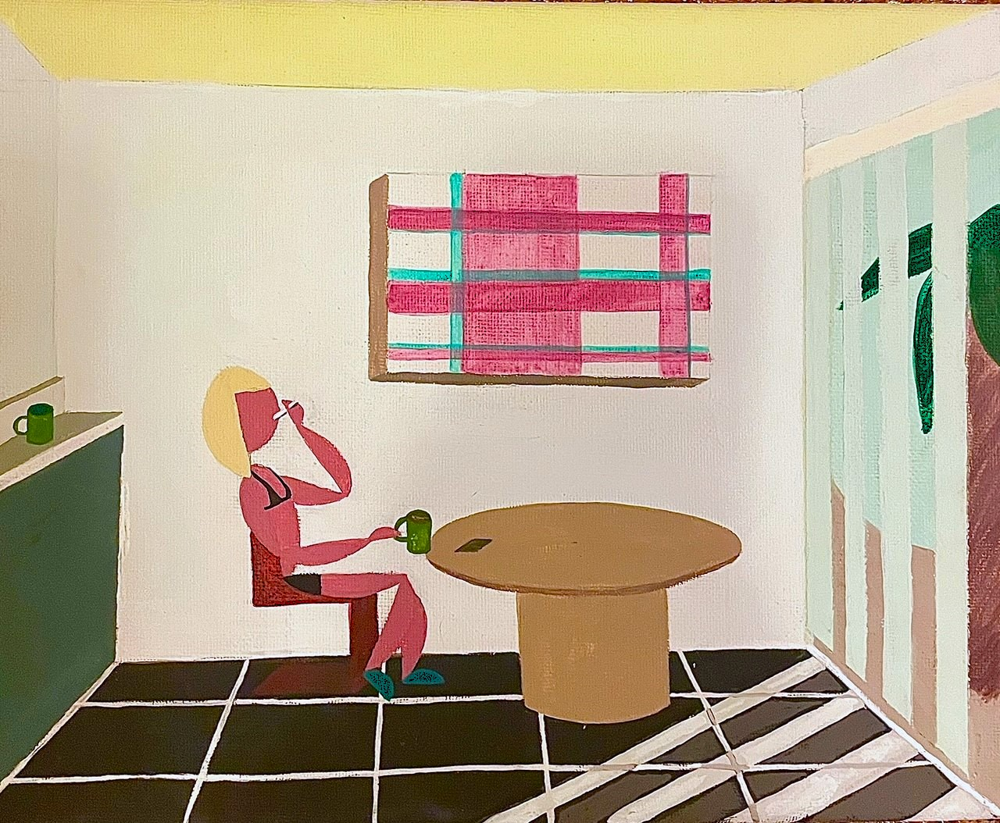

---
---
### hot and chill series
- [chillin in delray 2023](http://example.com/) 

- [on the stoop 2023](http://example.com/) 

- [chillin by the fire hbu 2023](/pdf/sample_presentation.pdf) 

- [hot and chill besties 2021](/sample_page) 

---

### Tessellations

- [Las Joyas 2024](/sample_page) 

- [La Divina 2024](/sample_page) 

### Astro Hex Signs
- [Eclipse 2024](/sample_page) 

- [Zodiac 2024](/sample_page) 

- [Project 5 Title](http://example.com/)

---

---

Page template forked from <a href="https://github.com/evanca/quick-portfolio">evanca</a>

<!-- Remove above link if you don't want to attibute -->
